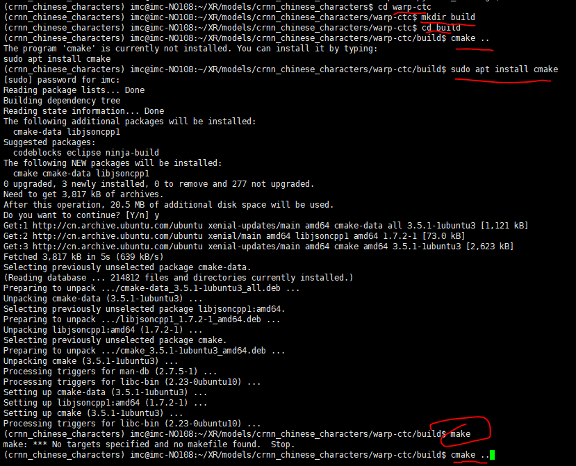
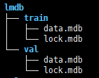
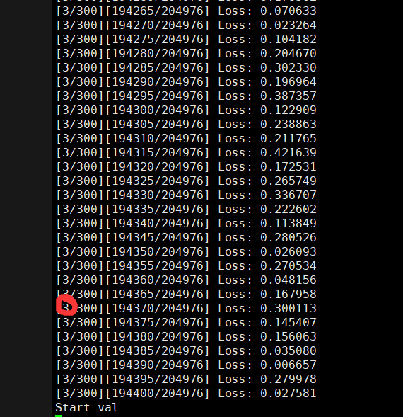

Follow my steps directly

------

- ## install

  this is crnn_chinese_characters: https://github.com/Sierkinhane/crnn_chinese_characters_rec

  Reference  https://www.cnblogs.com/sierkinhane/p/9715582.html

```
conda create -n crnn_chinese_characters python=3.6
```


```
conda activate crnn_chinese_characters

cd crnn_chinese_characters
```


```
pip install -i https://pypi.tuna.tsinghua.edu.cn/simple torch torchvision
```


```
pip install decorator cloudpickle>=0.2.1 dask[array]>=1.0.0 matplotlib>=2.0.0 networkx>=1.8 scipy>=0.17.0 bleach python-dateutil>=2.1 decorator
```

install warp-ctc: https://github.com/SeanNaren/Warp-ctc

```
unzip warp-ctc-pytorch_bindings.zip
cd warp-ctc
mkdir build; cd build
cmake ..
make
```



```
cd pytorch_binding
python setup.py install
```


- ## Test


- ## Training

  making our datasets

   Download 3.6 million Chinese datasets first  <https://pan.baidu.com/s/1ufYbnZAZ1q0AlK7yZ08cvQ>

  The corresponding label of the picture: https://pan.baidu.com/s/1jfAKQVjD-SMJSffOwGhh8A 密码：u7bo

  first. divide the datasets into train-datasets & val-datasets

  ```
  actually i use my own datasets，my datasets have 10 thousands and 50 hundreds，so。。
  i divide these images into two folders：train & val
  i divide the labels.txt into two folders：train.txt & val.txt
  ```

  ```
  train folder：including 10 thousands image and the train.txt
  val folder：including 50 hundreds image and the val.txt
  ```

  

  The next step is to make data in lmdb format.

  ```
  create a new folder：lmdb
  under the lmdb folder：create two folders：train & val 
  ```

  Modify the corresponding contents in the **tolmdb.py**，as a result ，generate .mdb files

  Modify twice the path，corresponding **train** & **val**

  

  run twice

  ```
  python2 tolmdb.py  #note：must be python2
  ```

  

  and then....training

  ```
  python crnn_main.py --trainroot /lmdb/360label/train/ --valroot /lmdb/360label/val/ --cuda
  ```

  

5